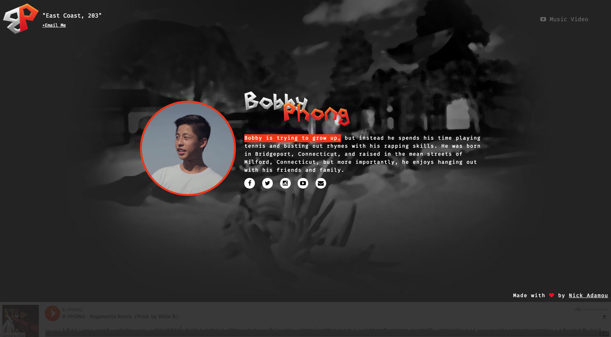

# BobbyPhong.me

Made By: [Nick Adamou](https://nickadamou.github.io/index.html)

## Requirements
This project does have some requirements that you will need to meet in order for you to use it, however, no need to fear, as there is, but two simple, requirement that this project needs; this being that you will need Jekyll and Bundler installed on your native system. You can go to [Jekyll](http://jekyllrb.com/) and [Bundler](http://bundler.io/) then follow through the installation processes, however, there is only three lines you need to know in order to use this project, that being the following:
```
sudo gem install jekyll  -> Installs Jekyll
sudo gem install bundler -> Installs Bundler
bundle exec jekyll serve -> Sets up the site/server
```

## Install
In order to start using this project, you will need to clone/download it to your machine.
After you have it on your machine, open up your terminal application and type the following:

```
sudo gem install jekyll
sudo gem install bundler
bundle install
```

After the process finishes, you can start the server by doing the following:

1. Open up your terminal application
2. Navigate to this project folder's root
3. Type in the following command:
```
bundle exec jekyll serve
```

After the process finishes, you will have compiled all the code necessary for the project to work and, additionally, you will have this project running on a temporary port on your localhost.
